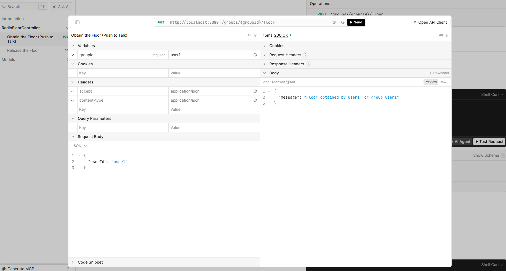

Run 

`docker-compose up -d --build
`

Go to:

http://localhost:8080/scalar/v1

in order to test endpoints using Scalar UI integration.

## Endpoints

### POST /groups/{groupId}/floor

**Summary:** Obtain the Floor (Push to Talk)

**Description:** Allows a user to request and obtain the "floor" for a specified radio group. Only one user can hold the floor at a time.

Example:
```
POST http://localhost:8080/groups/group1/floor
Content-Type: application/json

{
  "userId": "user1"
}
```



### DELETE /groups/{groupId}/floor/{userId}

**Summary:** Release the Floor

**Description:** Allows a user to release the floor they are holding for a specified group.

Example:
```
DELETE http://localhost:8080/groups/group1/floor/user1
```